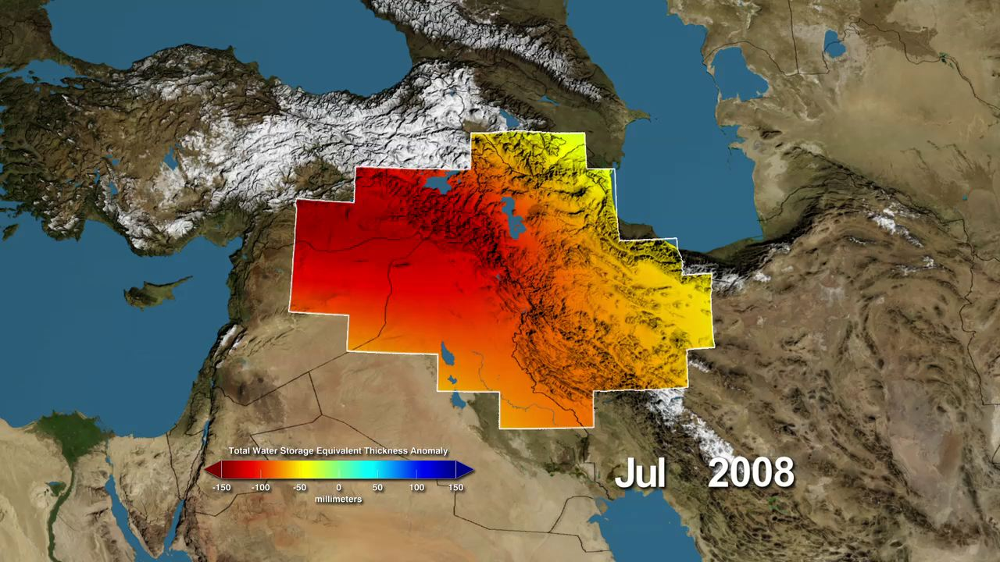
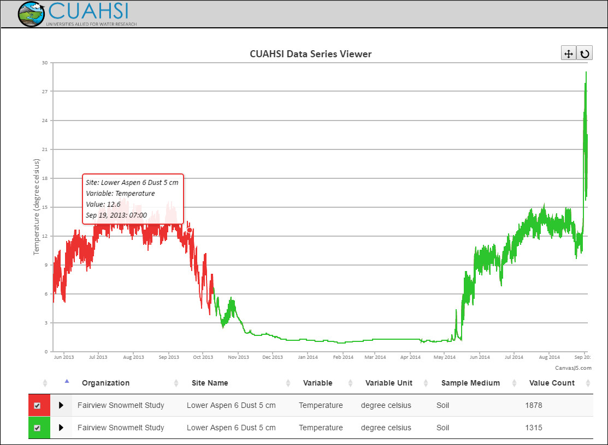
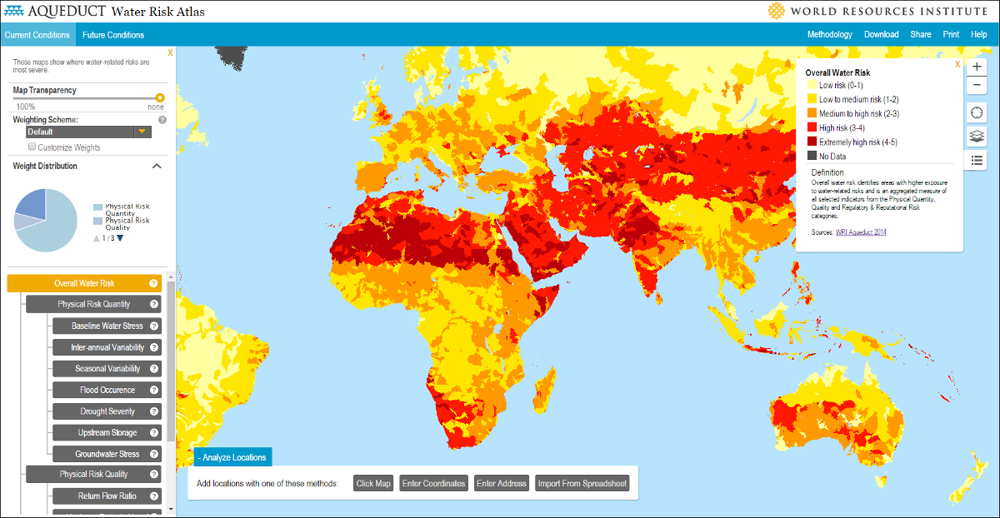

_As an introduction to the blog, this post will review data visualisation in hydrology and explore why it is so important. To find out a little bit about me and the website as a whole please check out the <a href="../about">about </a> section._

The analysis and visualisation of spatio-temporal data is fundamental to  the practice of hydrology. The spatial distribution of elevation, vegetation, geology, soil, and other phenomena across a catchment determines its hydrological regime and its response to disturbances, such as land use change. Consequently, spatial analysis is a starting point for many hydrological studies and management decisions, with maps being the main method of visualising outputs. 

The temporal aspect is just as important. Too much rain over a short period of time can trigger floods, while too little over longer periods leads to droughts. Understanding trends in rainfall, streamflow, and other hydrological processes allows predictions to made of future conditions. Greater understanding results in more accurate predictions that have greater utility for water management decision-making and, for example, mitigating risks associated with climate change. To aid understanding, a range of methods, such as hydrographs, hyetographs, and Intensity-Duration-Frequency curves, have been developed to visualise time-series data in hydrology. 

<iframe src="../figs/lyd-annual-hydrograph.html" style="border:none;" scrolling="no"></iframe>

Hydrological data is often analysed and visualised alongside data from other disciplines. For example, combining hydrological and socio-economic data is key to providing people with a reliable supply of water. Along these lines, data visualisation has been recognised as a key component for accomplishing the recently agreed <a href="https://sustainabledevelopment.un.org/?menu=1300">Sustainable Development Goals</a>, of which the sixth is to ‘ensure availability and sustainable management of water and sanitation for all’. 

The power of visualisations is that they leverage our cognitive abilities to recognise patterns and identify trends and can therefore quickly impart large amounts of complex information1.  Well-designed and aesthetically-pleasing visualisations engage viewers more deeply and are therefore better at communicating underlying messages, particularly to non-experts2. By making it more understandable and more engaging, good visualisations increase the probability that information will be used to support or inform decision-making3. 

One trend that is further heightening the importance of visualisation in hydrology is increasing data availability4. Remote sensing has become a vital source of data for hydrological studies, particularly for deriving land use and topographic information.  In recent years, the accessibility, accuracy and utility of remotely sensed datasets of a range of hydrological phenomena, such as precipitation, evapotranspiration, soil moisture, and groundwater, have increased rapidly5.

<figure>
 
 <figcaption>Groundwater depletion estimates derived from data collected by the GRACE satellites - <a href="http://www.jpl.nasa.gov/news/news.php?release=2013-054">Image source</a>.</figcaption>
</figure>

While satellites are still the primary remote sensing platform, drones or UAVs are increasingly used to collect <a href="http://www.iwmi.cgiar.org/2015/09/elevated-learning/">high-resolution datasets at local scales</a> and at reduced cost. In addition to remote sensing, the rapid development of smart sensors and communication technology mean that ground-based hydrometric networks are collecting increasing amounts of real-time high-resolution data6. The rising prominence of citizen scientists is another growing source of data.7. 

Building on developments in web technology, web-portals and environmental virtual observatories have become popular methods for visualising and sharing hydrological data8.  It is notable that the ability of developers to create interactive and innovative visualisations is increasing the utility of these platforms in a decision-making context2. A good example is <a href="https://www.hydroshare.org/">HydroShare</a>, developed recently by <a href="https://www.cuahsi.org/">CUASHI</a>, that seeks to encourage collaborative analysis through the inclusion of social media tools and data analysis and visualisation apps. 

<figure>
 
 <figcaption>Screenshot of HydroShare's data viewer - <a href="https://www.hydroshare.org/resource/7be4a9c2f43b407f85aaf1154612d6a3/">data source</a>.</figcaption>
</figure>

More widely, news organisations, such as the New York Times, the Guardian, and the Economist, frequently support stories with visualisations, which are generally developed using <a href="https://en.wikipedia.org/wiki/Comparison_of_JavaScript_charting_frameworks">JavaScript charting libraries</a>, such as <a href="https://d3js.org/">D3</a>. These libraries are also the basis of the visualisation component of many web portals and virtual observatories. Arguably, there is great potential for utilising the libraries more widely in less complex applications, such as blogs and project websites.

One of biggest advantages of web-based interactive visualisations for hydrology is that the temporal and spatial aspects of data can be more easily combined, particularly through the use of animation. Probably the most famous examples of this, although not hydrology, is the <a href="https://www.gapminder.org/tools/#_chart-type=bubbles">Gapminder visualisation</a> developed by Hans Rosling, which shows how the average income and life expectancy of countries has evolved over time. The interactivity that can be added to web-based visualisations allows users to explore the data and draw their own conclusions, which is in contrast to the purely explanatory nature of most visualisations3.  

<figure>
 
 <figcaption><a href="http://www.wri.org/our-work/project/aqueduct">The Aqueduct tool </a> developed by The World Resources Institute visualises global water risks.</figcaption>
</figure>

Beyond traditional data portals and virtual observatories, there are some great examples of hydrology-related visualisations on the web. Below is a list of a few of the best ones I’ve come across in the last year or so: 

<ul>
<li><a href="http://www.nytimes.com/interactive/2015/10/27/world/greenland-is-melting-away.html">Greenland is Melting Away</a> - This report by the New York Times includes some great interactive maps that support a story on monitoring the surface hydrology of the Greenland ice sheet.</li>
<li>US <a href="http://vis.ecowest.org/interactive/precip.php#s=conus&m=regular&h=1">precipitation</a> and <a href=""> drought</a> - A couple of interesting visualisations by EcoWest that show  precipitation and drought variation across the US.</li> 
<li><a href="http://www.nytimes.com/interactive/2012/08/11/sunday-review/drought-history.html">Drought and Deluge in the Lower 48</a> - A visualiation by the New York Times that shows how the proportion of US states in drought has varied over the last century.</li>
<li><a href="http://salmonexplorer.ca/#skeena/">Salmon Explorer</a> - A great set of visualisations that explores salmon populations and habitats in the Skeena catchment, British Columbia.</li>
<li><a href="http://projects.propublica.org/louisiana/#">Losing Ground</a> - A highly-detailed visualisation by ProPublica that investigates the challenges faced by the Mississippi Delta due to rising sea levels and erosion.</li>
<li><a href="http://www.nationalgeographic.com/climate-change/explore-amazonia/#/Art/WaterCycle/?focus=WaterNutrients">Amazonia Under Threat</a> - A beautiful piece by National Geographic that illustrates, among other things, the water cycle of the Amazon rainforest.</li>
<li><a href="http://www.nationalgeographic.com/clean-water-access-around-the-world/#select/TOT/total">See Where Access to Clean Water Is Getting Better—and Worse</a> - Another visualisation by National Geographic that shows how access to clean water has changed over time on a country-wise basis.</li>
<li><a href="http://www.wateraid.org/what-we-do/the-crisis/statistics/world-wash-map">World WASH Map</a> - This visualisation, developed for WaterAid, documents country-wise progress towards achieving universal access to clean water and sanitation.</li>
<li><a href="http://www.wri.org/applications/maps/aqueduct-atlas/#x=8.00&y=0.30&s=ws!20!28!c&t=waterrisk&w=def&g=0&i=BWS-16!WSV-4!SV-2!HFO-4!DRO-4!STOR-8!GW-8!WRI-4!ECOS-2!MC-4!WCG-8!ECOV-2!&tr=ind-1!prj-1&l=3&b=terrain&m=group">Aqueduct</a> - A mapping tool developed by the World Resources Institute that identifies various sources of water risks accross the world.</li>
<li><a href="http://aqua-monitor.appspot.com/">Aqua Monitor</a> - A mapping application, developed by Deltares, that shows global changes in surface water over the last 30 years.</li>
<li><a href="http://www.economist.com/news/essays/21689225-can-one-world-s-great-waterways-survive-its-development">The Mekong</a> - An essay by the Economist that makes nice use of maps and sound.</li>
</ul>

<h5 class="ref-title">Show References</h5>
<ol class="references">
 <li> Heer, J., Bostock, M. & Ogievetsky, V. 2010. A tour through the visualization zoo. <em>Communications of the ACM</em>. 53(6). <a href="http://dx.doi.org/10.1145/1743546.1743567">http://dx.doi.org/10.1145/1743546.1743567</a></li>
 <li> Karpouzoglou, T., Zulkafli, Z., Grainger, S., Dewulf, A., Buytaert, W. & Hannah, D.M. 2016. Environmental Virtual Observatories (EVOs): prospects for knowledge co-creation and resilience in the Information age. <em>Current Opinion in Environmental Sustainability</em>. 18. <a href="http://dx.doi.org/10.1016/j.cosust.2015.07.015">http://dx.doi.org/10.1016/j.cosust.2015.07.015</a></li>
 <li>McInerny, G., Chen, M., Freeman, R., Gavaaghan, D., Meyer, M., Rowland, F., Spiegelhalter, D., Stefaner, M., Tessarolo, G., & Hortal, J. 2014. Information visualisation for science and policy: Engaging users and avoiding bias. <em>Trends in Ecology & Evolution</em>. 29(3). <a href="http://dx.doi.org/10.1016/j.tree.2014.01.003">http://dx.doi.org/10.1016/j.tree.2014.01.003</a></li>
 <li>Buytaert, W., Baez, S., Bustamante, M., & Dewulf, A. 2012. Web-Based Environmental Simulation: Bridging the Gap between Scientific Modelling and Decision-Making. <em>Environmental Science & Technology</em>. 46. <a href="http://pubs.acs.org/doi/abs/10.1021/es2031278">http://dx.doi.org/10.1021/es2031278</a></li>
 <li>Lettenmaier, D.P., Alsdorf, D., Dozier, J., Huffman, G.J., Pan, M. & Wood, E.F. 2015. Inroads of remote sensing into hydrological science during the WRR era. <em>Water Resources Research.</em> 51(9). <a href="http://onlinelibrary.wiley.com/doi/10.1002/2015WR017616/abstract">http://dx.doi.org/10.1002/2015WR017616</a></li>
 <li>Reis, S., Seto, E., Northcross, A., Quinn, N.W.T., Convertino, M., Jones, R.L., Maier, H.R., Schlink, U., Steinle, S., Vieno, M. and Wimberly, M.C. 2015. Integrating modelling and smart sensors for environmental and human health. <em>Environmental Modelling & Software.</em> 74.  <a href="http://dx.doi.org/10.1016/j.envsoft.2015.06.003">http://dx.doi.org/10.1016/j.envsoft.2015.06.003</a></li>
 <li>Buytaert, W., Zulkafli, Z., Grainger, S., Acosta, L., Alemie, T.C., Bastiaensen, J., De Bievre, B., Bhusal, J., Clack, J., Dewulf, A., Foggin, M., Hannah, D.M., Hergarten, C., Isaeva, A., Karpouzoglou, T., Pandeya, B., Paudel, D., Sharma, K., Stennhuis, T., Tilahun, S., Van Hecken, G, & Zhumanova, M. 2014. Citizen science in hydrology and water resources: opportunities for knowledge generation, ecosystem service management, and sustainable development. <em>Frontiers in Earth Science.</em> 2(26). <a href="http://dx.doi.org/10.3389/feart.2014.00026 ">http://dx.doi.org/10.3389/feart.2014.00026</a></li>
 <li>Vitolo, C. Elkhatib, Y., Reusser, D., Macleod, C.J.A & Buytaert, W. 2015. Web technologies for environmental big data. <em>Environmental Modelling & Software.</em> 63. <a href="http://dx.doi.org/10.1016/j.envsoft.2014.10.007">http://dx.doi.org/10.1016/j.envsoft.2014.10.007</a> </li>
</ol>





